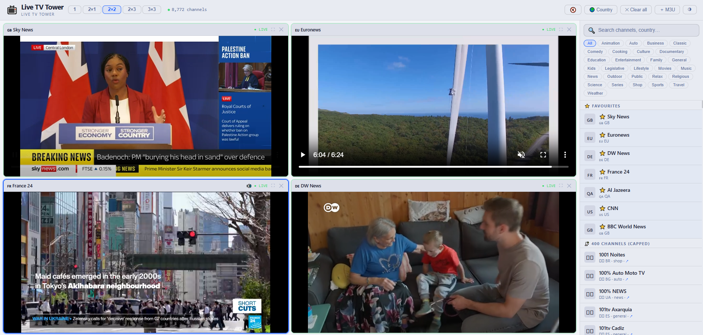

# 📡 Live TV Tower

**Watch up to 9 live streams simultaneously. 800+ channels. One HTML file.**

A free, open-source multi-stream TV wall. No app, no subscription, no install — open the file and start watching.


[](https://NameRami.github.io/LiveTVTower/LiveTVTower.html)
[](LICENSE)
[]()
[]()




---

## 🔴 [→ Open Live Demo](https://NameRami.github.io/LiveTVTower/LiveTVTower.html)

> No login. No install. Opens directly in your browser.

---

## ✨ Features

### 📺 Multi-Stream TV Wall

Watch multiple live channels at once in a flexible grid layout:

| Layout | Screens | Best for |
|--------|---------|----------|
| **1** | 1 stream | Focus mode |
| **2×1** | 2 streams side by side | Quick A/B comparison |
| **2×2** | 4 streams in a grid | Standard monitoring view |
| **2×3** | 6 streams in a grid | Multi-source coverage |
| **3×3** | 9 streams in a grid | Full broadcast wall |

**How it works:**
1. Click any screen slot to activate it
2. Pick a channel from the right-side browser — it loads instantly
3. Switch layouts at any time without losing running streams
4. Double-click any slot to go fullscreen
5. Close individual slots independently

### 📡 800+ Channel Catalogue

- Channels from **100+ countries** across every continent
- Filter by **category** — News, Sports, Entertainment, Kids, Music, and more
- **🌍 Country picker** — full overlay with flag grid, search by country name, instantly filters the channel list
- **Channel logos** for most channels
- **HLS streaming** with automatic URL fallback if a stream goes offline
- **Per-slot status** — `● LIVE`, `… loading`, `✕ offline`

### ⭐ Pinned Favourites

7 always-on channels shown at the top of the picker, ready to assign in one click:

🇬🇧 Sky News · 🇪🇺 Euronews · 🇩🇪 DW News · 🇫🇷 France 24 · 🇶🇦 Al Jazeera · 🇺🇸 CNN · 🇬🇧 BBC World News

### ➕ Custom M3U

Paste any `.m3u8` stream URL or M3U playlist URL to add your own channels. Imported channels appear in a dedicated **Custom** section at the top of the picker.

### 🔊 Smart Audio

- Only the **focused slot** plays sound — click any slot to focus it
- **Master mute** button silences everything instantly
- Unfocused slots play video silently in the background

### 🎨 UI

- **Dark / Light theme** toggle — preference saved to localStorage
- **Session persistence** — layout and loaded channels restored on next open
- Fullscreen per slot (double-click)
- Clean minimal interface — the content is the focus

---

## 🚀 Quick Start

```bash
git clone https://github.com/NameRami/LiveTVTower.git
cd LiveTVTower
open LiveTVTower.html   # macOS
# or just double-click LiveTVTower.html
```

No `npm install`. No server. No config.

Or use the **[live demo](https://NameRami.github.io/LiveTVTower/LiveTVTower.html)** — no cloning needed.

---

## 🌍 Country Picker

Click **🌍 Country** in the top bar to open the country overlay:

- Browse all countries that have available channels, sorted A→Z
- Each card shows the **flag**, **country name**, and **channel count**
- Search by country name or code
- Select a country to instantly filter the entire channel list
- Active country shown in the topbar button — click **✕ Clear** to reset
- Works alongside the category filter — pick Tunisia then filter by News

---

## ➕ Adding Custom Streams

Click **＋ M3U** in the top bar:

- **Single stream** — paste any `.m3u8` URL with a custom name
- **M3U playlist** — paste a playlist URL to import multiple channels at once, with names, logos, and country flags parsed automatically

Custom channels appear in a **Custom** section at the top of the picker.

---

## 🗂 Project Structure

```
LiveTVTower/
├── LiveTVTower.html    # The entire application — HTML + CSS + JS
├── README.md
├── LICENSE
└── CONTRIBUTING.md
```

Everything lives in `LiveTVTower.html`. No framework, no bundler, no dependencies to install.

---

## 🌐 Self-Hosting

### GitHub Pages (recommended)
1. Fork this repo
2. Go to **Settings → Pages → Source → main branch / root**
3. Live at `https://NameRami.github.io/LiveTVTower`

### Any static host
Drop `LiveTVTower.html` on Netlify, Vercel, Cloudflare Pages, or any web server.

### Local
```bash
python3 -m http.server 8080
# open http://localhost:8080/LiveTVTower.html
```

---

## 🤝 Contributing

The most impactful contributions:

- **Stream URLs** — channels go dead. PRs that fix or add working HLS stream URLs for pinned favourites are always useful
- **Pinned favourites** — suggest reliable global news channels to add to the default list
- **Bug fixes** — especially HLS fallback issues, CORS errors, or layout bugs on specific browsers

Please read [CONTRIBUTING.md](CONTRIBUTING.md) before opening a PR.

---

## 🛠 Tech Stack

| Layer | Technology |
|-------|-----------|
| HLS streaming | [hls.js](https://github.com/video-dev/hls.js/) |
| Hosting | Any static host / GitHub Pages |

No frameworks. No bundler. No npm.

---

## 🔗 Related Project

**[PressRadar](https://github.com/NameRami/PressRadar)** — Real-time global news intelligence dashboard. Live news feeds, 3D globe with earthquake alerts, and an integrated TV wall. Live TV Tower was spun out of PressRadar as a standalone project.

---

## ⚠️ Disclaimer

Live TV Tower does not host, store, or redistribute any video content. All streams are publicly available — stream availability is not guaranteed and depends on third-party providers. This tool is intended for personal use.

---

## 📄 License

MIT — see [LICENSE](LICENSE)
